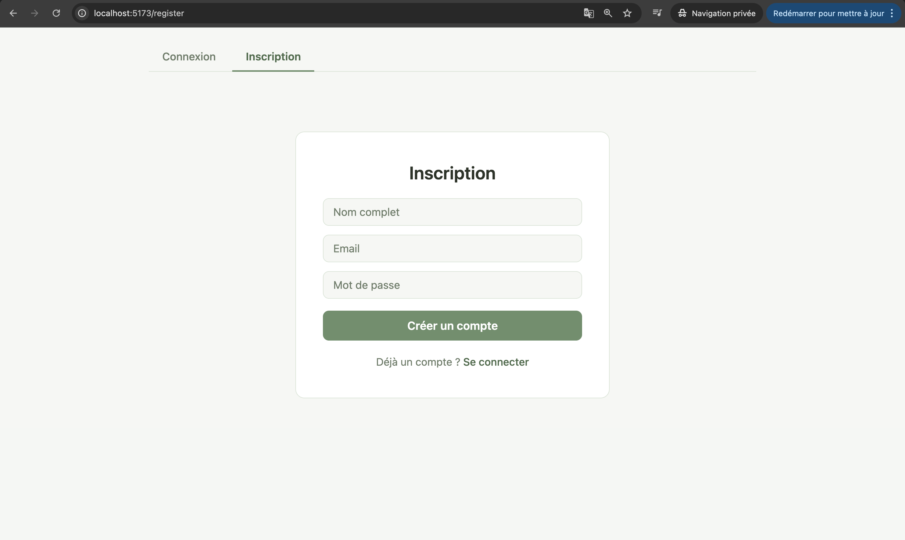
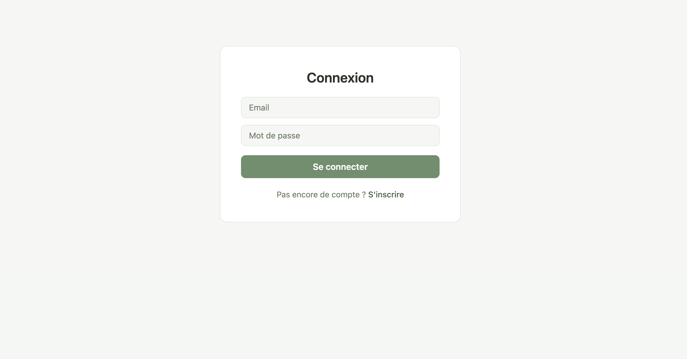
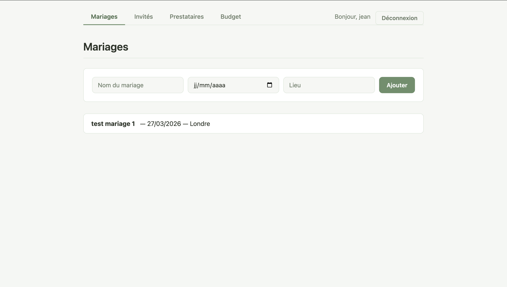
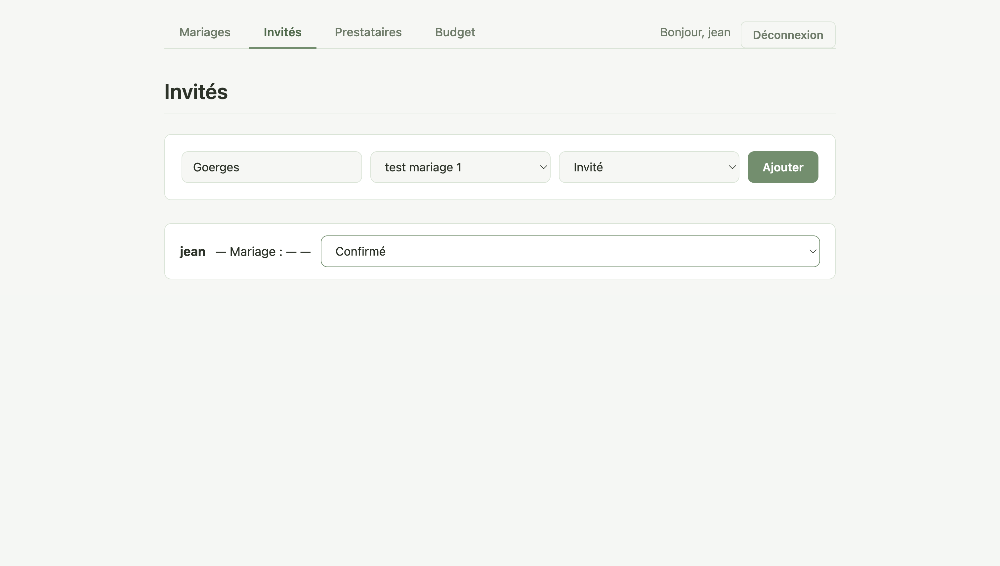
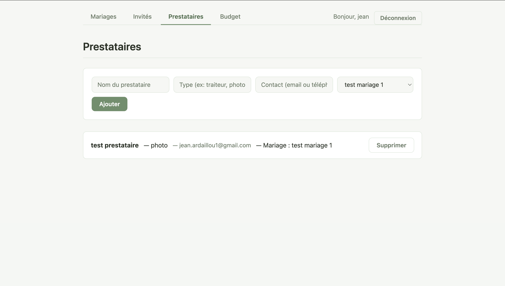
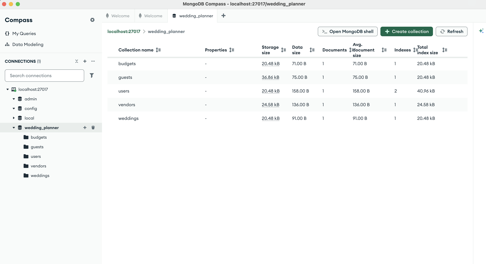
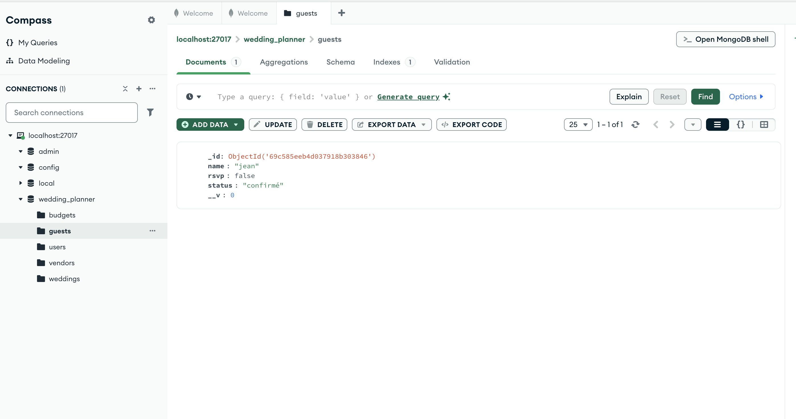

# Wedding Planner — Application MERN

## Objectif du projet

Application web full-stack de gestion de mariages permettant de gérer les mariages, les invités, les prestataires et le budget. L'accès à l'application est sécurisé par une authentification JWT (inscription / connexion).

---

## Technologies utilisées

| Côté | Technologies |
|------|-------------|
| **Backend** | Node.js, Express v5, MongoDB |
| **Frontend** | React 19, Vite|

---

## Architecture

```
wedding_planner-main/
├── server.js                  # Point d'entrée Express
├── .env                       # Variables d'environnement backend
├── models/
│   ├── User.js                # Schéma utilisateur (nom, email, mot de passe hashé)
│   ├── Wedding.js             # Schéma mariage (nom, date, lieu)
│   ├── Guest.js               # Schéma invité (nom, statut, weddingId)
│   ├── Vendor.js              # Schéma prestataire (nom, type, contact, weddingId)
│   └── Budget.js              # Schéma budget (titre, montant, payé)
├── routes/
│   ├── authRoutes.js          # POST /api/auth/register et /api/auth/login
│   ├── weddingRoutes.js       # CRUD /api/weddings (protégé)
│   ├── guestRoutes.js         # CRUD /api/guests (protégé)
│   ├── vendorRoutes.js        # CRUD /api/vendors (protégé)
│   └── budgetRoutes.js        # CRUD /api/budgets (protégé)
├── middleware/
│   └── auth.js                # Middleware JWT — vérifie le token Bearer
└── client/                    # Frontend React (Vite)
    ├── .env                   # VITE_API_URL
    └── src/
        ├── App.jsx            # Router, routes protégées, nav
        ├── context/
        │   └── AuthContext.jsx  # Contexte auth global (token, user, login, logout)
        └── pages/
            ├── LoginPage.jsx
            ├── RegisterPage.jsx
            ├── WeddingsPage.jsx
            ├── GuestsPage.jsx
            ├── VendorsPage.jsx
            └── BudgetPage.jsx
```

---

## Configuration des fichiers `.env`

### Backend — `/wedding_planner-main/.env`
```env
MONGO_URI=mongodb://localhost:27017/wedding_planner
PORT=5001
JWT_SECRET=wedding_planner_secret_key_2024
```

### Frontend — `/wedding_planner-main/client/.env`
```env
VITE_API_URL=http://localhost:5001/api
```

---

## Routes principales de l'API

### Authentification (routes publiques)
| Méthode | Route | Description |
|---------|-------|-------------|
| POST | `/api/auth/register` | Créer un compte (name, email, password) |
| POST | `/api/auth/login` | Se connecter — retourne un token JWT |

### Routes protégées (nécessitent `Authorization: Bearer <token>`)
| Méthode | Route | Description |
|---------|-------|-------------|
| GET | `/api/weddings` | Lister tous les mariages |
| POST | `/api/weddings` | Créer un mariage |
| PUT | `/api/weddings/:id` | Modifier un mariage |
| DELETE | `/api/weddings/:id` | Supprimer un mariage |
| GET | `/api/guests` | Lister tous les invités |
| POST | `/api/guests` | Ajouter un invité (avec weddingId) |
| PUT | `/api/guests/:id` | Modifier le statut d'un invité |
| DELETE | `/api/guests/:id` | Supprimer un invité |
| GET | `/api/vendors` | Lister tous les prestataires |
| POST | `/api/vendors` | Ajouter un prestataire (avec weddingId) |
| DELETE | `/api/vendors/:id` | Supprimer un prestataire |
| GET | `/api/budgets` | Lister les dépenses |
| POST | `/api/budgets` | Ajouter une dépense |
| PUT | `/api/budgets/:id` | Marquer comme payé/non payé |
| DELETE | `/api/budgets/:id` | Supprimer une dépense |

---

## Fonctionnement global

### Authentification
1. L'utilisateur crée un compte via `/register` — le mot de passe est **hashé avec bcryptjs** avant d'être stocké dans MongoDB.
2. Lors de la connexion via `/login`, le mot de passe est comparé au hash.
3. Le frontend stocke le token dans le `localStorage` et l'envoie dans chaque requête via le header `Authorization: Bearer <token>`.
4. Le middleware `auth.js` vérifie ce token avant d'autoriser l'accès aux routes protégées.

### Communication Frontend ↔ Backend
- Le frontend utilise l'API `fetch` native avec `VITE_API_URL` comme base URL.
- Chaque requête vers une route protégée inclut le token JWT dans le header `Authorization`.
- CORS est configuré pour autoriser uniquement `http://localhost:5173`.

### Stockage des données (MongoDB)
- Les données sont stockées dans la base `wedding_planner` via Mongoose.
- Les **invités** (`Guest`) et **prestataires** (`Vendor`) contiennent un champ `weddingId` (référence `ObjectId` vers un mariage) pour lier l'entité à un mariage spécifique.

### Liaison des entités
- Lors de l'ajout d'un invité ou d'un prestataire, un menu déroulant permet de sélectionner le mariage auquel il est rattaché.
- Le `weddingId` est envoyé dans le corps de la requête POST et stocké dans MongoDB.

---

## Captures d'écran

### Page d'inscription


### Page de connexion


### Liste des mariages


### Ajout d'un invité lié à un mariage


### Ajout d'un prestataire lié à un mariage


### MongoDB Compass — Vue générale


### MongoDB Compass — Collection invités

